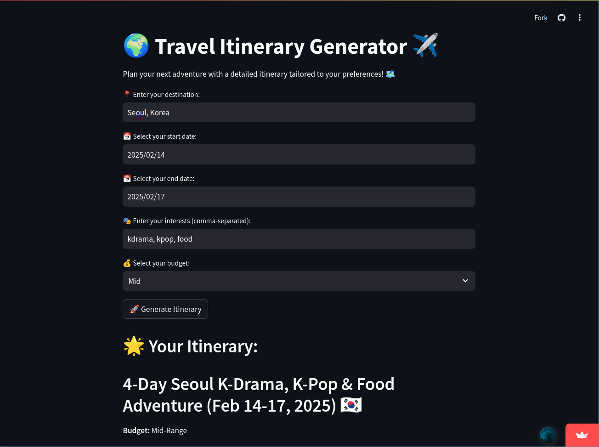

# Travel Planner

An AI-powered itinerary planner that helps you create personalized travel plans based on your preferences, budget, and destination.

## Features
- Works with any location worldwide.
- Customizes itineraries based on your interests.
- Adjusts plans according to budget categories: **low, mid, high**.

## Demo
Try the live demo: [Travel Planner](https://travel-planner-ts.streamlit.app/)

## Preview

## Usage
1. Enter your destination.
2. Select your interests (e.g., nature, history, food, adventure).
3. Choose your budget preference.
4. Get a customized itinerary instantly!

## License
This project is licensed under the MIT License.
